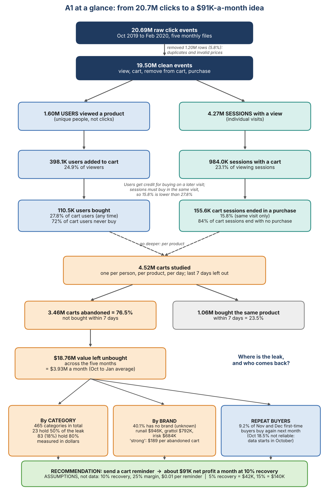

# A1: Cart leakage and repeat cohorts (Databricks SQL)

**Question:** How much revenue leaks between add-to-cart and purchase, which categories and brands cause it, and what is a cart-reminder nudge worth per month?

**Answer:** About $3.93M of cart value goes unbought each month (76.5% of carts abandoned); 83 of 465 categories hold 80% of it. A nudge recovering 10% is worth about $91K a month net, at an assumed 25% margin.

## Key findings

| Finding | Number |
|---|---|
| Events analysed (after cleaning) | 19.50M of 20.69M raw (5.8% removed) |
| Carts studied | 4.52M (one per user, product and day) |
| Carts abandoned (not bought within 7 days) | 3.46M, or 76.5% |
| Cart value left unbought | $18.76M over five months, about $3.93M a month |
| Category concentration | 23 of 465 categories hold 50% of the leak; 83 hold 80% |
| Repeat buyers | 9.2% of Nov and Dec first-time buyers buy again the next month |
| Value of a cart reminder at 10% recovery | About $91K a month net (5% = $42K, 15% = $140K) |

## Recommendation

Send a cart-reminder nudge, starting with the 23 categories that hold half of the leak. Run it as a holdout test before rolling it out, so the real recovery rate replaces the assumed one. Full detail is in the [memo](A1_memo.md).

## Method

1. Load five monthly CSVs into Delta tables.
2. Profile and clean: remove duplicate rows and invalid prices.
3. Build the funnel (view, cart, purchase) by users and by sessions.
4. Define an abandoned cart: the same user did not buy the same product within 7 days of adding it. The last 7 days of data are excluded, so every cart has a full 7-day window.
5. Value the leak in dollars by month, brand and category, with a Pareto analysis.
6. Build first-purchase cohorts and measure repeat rates.
7. Price a reminder nudge using clearly stated assumptions.

## Assumptions and limits

- **Assumed, not measured:** 10% recovery rate, 25% margin, $0.01 cost per reminder.
- Prices have no currency label in the source data; results are stated in $.
- The October cohort repeat rate (18.5%) is not reliable because the data starts in October, so earlier buyers look like new ones.
- 40.1% of abandoned value has no brand recorded, so brand results cover the rest.
- "Abandoned" means no purchase of the same product within 7 days. A buyer who returns later, or buys a similar product, still counts as abandoned.

## Tools

Databricks Free Edition, Unity Catalog, Delta tables, Databricks SQL (CTEs, window functions, EXISTS, date functions).

## Files

- [A1_memo.md](A1_memo.md): one-page memo with the recommendation
- [A1_queries_as_run.sql](A1_queries_as_run.sql): all queries, exactly as run
- [A1_Funnel_Tree.png](A1_Funnel_Tree.png): funnel and findings at a glance

## Data

[eCommerce Events History in Cosmetics Shop](https://www.kaggle.com/datasets/mkechinov/ecommerce-events-history-in-cosmetics-shop) (REES46 / Open CDP, Kaggle), Oct 2019 to Feb 2020. Credit: REES46 Marketing Platform. Raw files are not included in this repo (about 2.4 GB).

## Reproduce

Upload the five monthly CSVs to a Databricks volume (`/Volumes/workspace/cart_leakage/raw/`) and run the queries in order.
